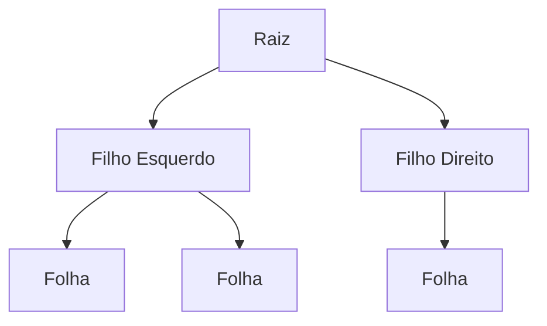

# Árvores: Estruturas de Dados

## Introdução
As árvores são estruturas hierárquicas não lineares compostas por nós (nodos), amplamente utilizadas para:
- Sistemas de arquivos
- Interfaces gráficas
- Bancos de dados
- Sites

## Conceitos Fundamentais

### Elementos Básicos


- **Nó/Nodo**: Unidade que armazena dados
- **Raiz**: Nó inicial da árvore
- **Aresta**: Conexão entre nós
- **Nó folha**: Nó sem filhos
- **Grau**: Número de filhos de um nó

### Relações e Métricas
- **Profundidade**: Distância do nó até a raiz
- **Altura**: Maior distância entre raiz e folha
- **Nível**: Camada horizontal da árvore
- **Subárvore**: Estrutura formada por um nó e seus descendentes

## Árvores Binárias de Pesquisa (BST)

### Características
- Máximo 2 filhos por nó
- Nós à esquerda < Nó pai
- Nós à direita > Nó pai

### Operações Principais
1. **Inserção**: O(h)
2. **Busca**: O(h)
3. **Remoção**: O(h)
   - Folha: remoção direta
   - 1 filho: reconexão
   - 2 filhos: substituição pelo sucessor
  
   
## Árvores de Comparação**

### **O que são Árvores de Comparação?**
As **árvores de comparação** são estruturas visuais que representam o processo decisório de algoritmos que dependem de comparações entre elementos, como os algoritmos de ordenação e pesquisa. Elas permitem ilustrar, passo a passo, como um conjunto de elementos é analisado e organizado com base em critérios específicos (como ordem crescente ou decrescente).

---

### **Estrutura de uma Árvore de Comparação**
- Cada **nó interno** da árvore representa uma **comparação entre dois elementos**.
- Cada **ramo** é um possível resultado da comparação (**Sim** ou **Não**).
- Cada **folha** representa um **resultado final**, como a ordem dos elementos ou a localização de um elemento em um conjunto.

Exemplo: Ordenação de três elementos (`A`, `B`, `C`).

```
             (A < B)?
            /        \
         Sim          Não
         /              \
      (B < C)?        (A < C)?
      /     \          /    \
   Sim      Não      Sim     Não
   /          \     /         \
 ABC            ACB           CBA
```

Nesta árvore:
1. O algoritmo primeiro verifica se `A < B`.  
2. Com base no resultado, ele segue pelo **ramo esquerdo (Sim)** ou **direito (Não)**.  
3. Novas comparações são feitas até que uma ordem final seja determinada.

---

### **Propriedades das Árvores de Comparação**
1. **Profundidade da Árvore**:
   - Determina o número máximo de comparações necessárias.
   - Para ordenar `n` elementos, a profundidade máxima é proporcional a **O(n log n)** no caso médio para algoritmos eficientes.
2. **Folhas**:
   - Cada folha representa uma possível permutação dos elementos.
   - Com `n` elementos, há **n!** folhas (todas as permutações possíveis).
3. **Ramos**:
   - Os ramos correspondem aos resultados das comparações, levando a diferentes caminhos de decisão.

---

### **Aplicações das Árvores de Comparação**
As árvores de comparação são úteis em diversos contextos de algoritmos:

#### **1. Ordenação**
- Utilizadas para demonstrar como algoritmos de ordenação, como o **QuickSort**, **MergeSort** e **HeapSort**, tomam decisões para organizar os elementos.
- Exemplo: Determinar a sequência correta de uma lista como `[3, 1, 2]`.

#### **2. Pesquisa**
- Em algoritmos de pesquisa, como a **Pesquisa Binária**, a árvore ajuda a visualizar como o conjunto é dividido recursivamente até encontrar o elemento desejado.

#### **3. Análise de Algoritmos**
- As árvores permitem calcular o **número de comparações necessárias** no pior, melhor e caso médio de um algoritmo.

---

### **Exemplo Prático: Ordenação com Árvores de Comparação**
Considere a lista `[5, 2, 9]` e o algoritmo verificando as condições para ordená-la:

```
              (5 < 2)?
             /       \
          Não        Sim
          /           \
     (5 < 9)?      (2 < 9)?
     /      \       /      \
   Não      Sim   Sim       Não
   /         \      \         \
  9 5 2    5 9 2   2 5 9    2 9 5
```

- A sequência de decisões define a posição de cada elemento na lista ordenada.

--- 
  
### ****
As árvores de comparação são uma poderosa ferramenta teórica e prática para entender o funcionamento de algoritmos baseados em decisões. Elas não apenas explicam como os dados são processados, mas também ajudam a avaliar a eficiência de diferentes abordagens. Por isso, são amplamente usadas em contextos acadêmicos e na prática profissional.
